# Crime-Analysis-In-Derbyshire

## INTRODUCTION
In the realm of banking, keeping customers satisfied and preventing them from leaving is crucial. This report dives into a dataset focused on customers who have stopped using the credit card services of a bank. The goal is to not only predict potential churn but also understand the factors that contribute to it, using a mix of predictive modelling and statistical methods.
Also, comprehending sales trends and industry influencers is crucial for publishers and developers alike in the ever-changing video game market. An in-depth analysis of a video game sales dataset is also conducted in this research, including a wide range of factors including sales in North America, Europe, and worldwide markets as well as platform, genre, publisher, and more.

## BANK CHURNERS DATASET OVERVIEW:
The dataset contains a bunch of information about customers, including their age, gender, marital status, credit limit, and more. I am digging into this data to figure out why customers decide to stop using their credit card services. This report is structured to guide you through my journey. I start by looking at the big picture through data exploration. Then, I’ll build a tool to predict potential churn. Simultaneously, I’ll use simple statistical tests to uncover more insights about why customers might be leaving.
I aim to provide the bank’s management with clear and practical information, helping them make informed decisions to improve customer satisfaction and retention.
The dataset is a bank dataset which contains information about customers of a bank, including their age, gender, marital status, credit limit, and more as well as their attrition status. The data set has 9 variables, and 10,127 observations so parametric tests would be used to investigate the dataset without normality checks because the sample size is large (n>30). I am digging into this data to determine why customers stop using their credit card services.

_Importing the Bank Churners dataset (Dataset 1)_

Note: The dataset was cleaned by removing not needed columns using Excel.

```r
library(readr)
Bank <- read.csv("BankChurners.csv")
#Checking the contents of the data
head(Bank)
```
*Output*

| Attrition_Flag     | Customer_Age | Gender | Dependent_count | Education_Level | Marital_Status | Income_Category | Card_Category | Credit_Limit | Total_Revolving_Bal | Total_Trans_Amt |
|--------------------|--------------|--------|-----------------|-----------------|----------------|-----------------|---------------|--------------|---------------------|-----------------|
| Existing Customer  | 45           | M      | 3               | High School     | Married        | $60K - $80K     | Blue          | 12691        | 777                 | 1144            |
| Existing Customer  | 49           | F      | 5               | Graduate        | Single         | Less than $40K  | Blue          | 8256         | 864                 | 1291            |
| Existing Customer  | 51           | M      | 3               | Graduate        | Married        | $80K - $120K    | Blue          | 3418         | 0                   | 1887            |
| Existing Customer  | 40           | F      | 4               | High School     | Unknown        | Less than $40K  | Blue          | 3313         | 2517                | 1171            |
| Existing Customer  | 40           | M      | 3               | Uneducated      | Married        | $60K - $80K     | Blue          | 4716         | 0                   | 816             |
| Existing Customer  | 44           | M      | 2               | Graduate        | Married        | $40K - $60K     | Blue          | 4010         | 1247                | 1088            |

## SUMMARY OF THE DATA SET

```r
summary(Bank)
```
*Output*

| Attrition_Flag    | Customer_Age | Gender | Dependent_count | Education_Level | Marital_Status | Income_Category  | Card_Category | Credit_Limit | Total_Revolving_Bal | Total_Trans_Amt |
|-------------------|--------------|--------|-----------------|-----------------|----------------|------------------|---------------|--------------|---------------------|-----------------|
| Existing Customer | 45           | M      | 3               | High School     | Married        | $60K - $80K      | Blue          | 12691        | 777                 | 1144            |
| Existing Customer | 49           | F      | 5               | Graduate        | Single         | Less than $40K   | Blue          | 8256         | 864                 | 1291            |
| Existing Customer | 51           | M      | 3               | Graduate        | Married        | $80K - $120K     | Blue          | 3418         | 0                   | 1887            |
| Existing Customer | 40           | F      | 4               | High School     | Unknown        | Less than $40K   | Blue          | 3313         | 2517                | 1171            |
| Existing Customer | 40           | M      | 3               | Uneducated      | Married        | $60K - $80K      | Blue          | 4716         | 0                   | 816             |
| Existing Customer | 44           | M      | 2               | Graduate        | Married        | $40K - $60K      | Blue          | 4010         | 1247                | 1088            |

| Variable            | Length | Min   | 1st Qu. | Median | Mean  | 3rd Qu. | Max   | Class   | Mode           |
|---------------------|--------|-------|---------|--------|-------|---------|-------|---------|----------------|
| Attrition_Flag      | 10127  |       |         |        |       |         |       | character | character    |
| Customer_Age        | 10127  | 26.00 | 41.00   | 46.00  | 46.33 | 52.00   | 73.00 | character | character    |
| Gender              | 10127  |       |         |        |       |         |       | character | character    |
| Dependent_count     | 10127  | 0.000 | 1.000   | 2.000  | 2.346 | 3.000   | 5.000 | character | character    |
| Education_Level     | 10127  |       |         |        |       |         |       | character | character    |
| Marital_Status      | 10127  |       |         |        |       |         |       | character | character    |
| Income_Category     | 10127  |       |         |        |       |         |       | character | character    |
| Card_Category       | 10127  |       |         |        |       |         |       | character | character    |
| Credit_Limit        | 10127  | 1438  | 2555    | 4549   | 8632  | 11068   | 34516 | numeric  | numeric       |
| Total_Revolving_Bal | 10127  | 0     | 359     | 1276   | 1163  | 1784    | 2517  | numeric  | numeric       |
| Total_Trans_Amt     | 10127  | 510   | 2156    | 3899   | 4404  | 4741    | 18484 | numeric  | numeric       |

The data set has no missing values with 11 variables and 10,127 observations so parametric tests would be used to investigate the dataset without normality checks because the sample size is large (n>30) and a Shapiro Test will not work because the sample size is >3,000.

## ONE SAMPLE T-TEST
*PROBLEM STATEMENT*: The bank wants to know if the average age of their clientele is 45.

*EXPLORATORY DATA ANALYSIS*: Using a histogram to investigate the frequency of customer ages.


*Histogram*
```r
hist(Bank$Customer_Age,xlab = "Age", ylab ="Frequency", main = "Histogram of Customer Ages", col = "blue")
```
*Output*

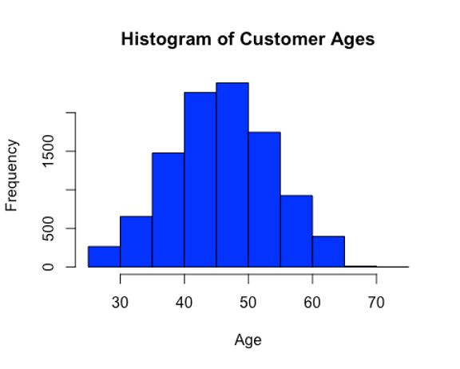

_Inference_: From the histogram, the majority of the clients are around 40-50 years old.

*Density Plot and Boxplot*
```r
plot(density(Bank$Customer_Age), main = "Density of Age Spread", col="red")
```
*Output*

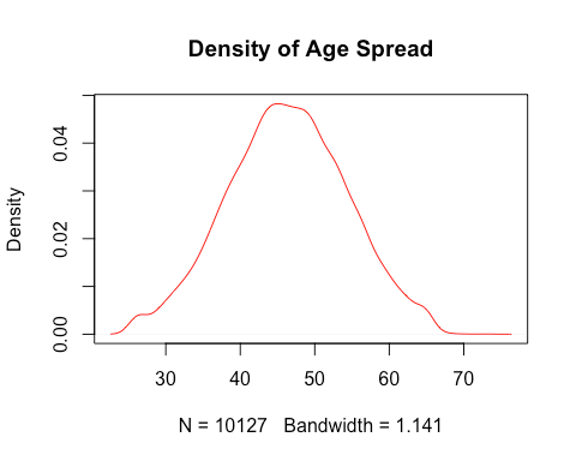

```r
boxplot(Bank$Customer_Age, main = "Boxplot of Customers' Age", col = "red")
```
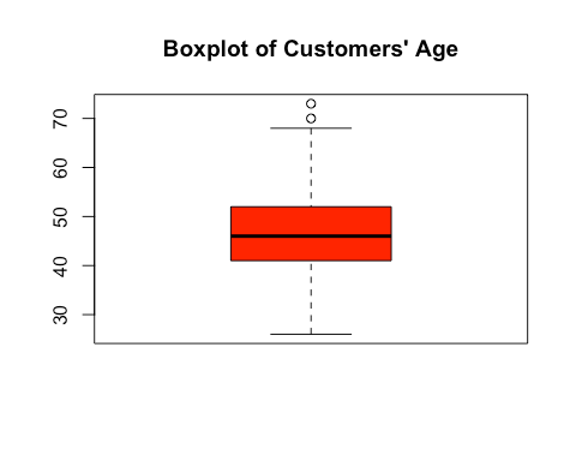

_AIM_: I aim to use a one sample t-test to see if the mean customer age is statistically different from 45 at the 95% confidence interval.

_ASSUMPTIONS_:
-  *Null Hypothesis (H0)*: The average customer age is equal to 45.
-  *Alternate Hypothesis (H1)*: The average customer age is not equal to 45.

```r
t.test(Bank$Customer_Age, mu=45)
```

*Output*

_data:  Bank$Customer_Age_

_t = 16.644, df = 10126, p-value < 2.2e-16_

_alternative hypothesis: true mean is not equal to 45_

_95 percent confidence interval:_

  _46.16980 46.48212_

_sample estimates:_
  _mean of x_ 
  _46.32596_

_RESULTS_: After conducting the T-test, the t-statistic was 16.644 with a 95% confidence interval of 46.16980 to 46.48212 and the p-value was < 2.2e-16.

_Inference_: Since the t-statistic is not in the confidence interval and the p-value is less than the 0.05 significance level, I reject the null hypothesis and accept the alternate hypothesis that the average customer age is not equal to 45.

## WELCH TWO SAMPLE T-TEST
*PROBLEM STATEMENT*: In exploring the credit dynamics within the customer base, a pertinent question arises: Do the credit limits of male and female customers differ significantly?

*EXPLORATORY DATA ANALYSIS*: Using a t-test to check if the credit limit of customers with respect to their genders are equal. Shapiro test failed to work because the sample size is too large (>3,000). To visualize the distributions of the credit limit of each gender and compare, box plots would be used.

```r
boxplot(Credit_Limit ~ Gender, data = Bank, main = "Credit Limit by Gender", col = c("pink","skyblue"))
```
*Output*

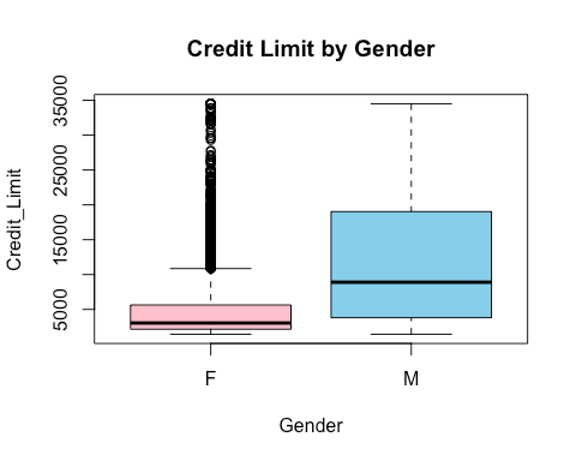

```r
bartlett.test(Bank$Credit_Limit ~ Bank$Gender) 
```

*Output*

_Bartlett test of homogeneity of variances_

 _data:  Bank$Credit_Limit by Bank$Gender_
 
 _Bartlett's K-squared = 2393.8, df = 1, p-value < 2.2e-16_

_Inference_: From the box plots, it is noticeable that the credit limit of the female gender has some outliers which could affect the mean and the medians of the credit limits by gender are not equal which could imply that the means are not equal and they have unequal variances. But a parametric t-test will be used to further investigate the claim gotten from the box plots. Because the sample is large, i.e n>30 there would be no need to test normality before the t-test. Also, the Bartlett test shows that they have unequal variances.

_AIM_: I will be carrying out a two-sample t-test to check if the credit limits across both genders are equal at the 95% confidence interval.

_ASSUMPTIONS_:
-  *Null Hypothesis (H0)*: The credit limits of each gender are equal.
-  *Alternate Hypothesis (H1)*: The credit limits of each gender are not equal.

```r
t.test(Bank$Credit_Limit ~ Bank$Gender, conf.level = 0.95)
```

*Output*

_Welch Two Sample t-test_ 

 _data:  Bank$Credit_Limit by Bank$Gender_
 
 _t = -45.052, df = 6773.7, p-value < 2.2e-16_
 
 _alternative hypothesis: true difference in means between group F and group M is not equal to 0_
 
 _95 percent confidence interval:_
 
  _-7995.201 -7328.441_
 
 _sample estimates:_
 
 _mean in group F mean in group M_ 
 
        _5023.854       12685.675_

_RESULTS_: After conducting the T-test, the t-statistic was -45.052 with a 95% confidence interval of -7995.201 to 7328.441 and the p-value was < 2.2e-16.

_Inference_: Since the t statistic does not fall inside the confidence interval and the p value is way less than 0.05, we reject the null hypothesis that says the credit limit of customers with respect to their genders are equal.

## ANOVA TEST
*PROBLEM STATEMENT*: In delving into the financial dynamics within the bank’s customer base, a critical inquiry emerges: Are the credit limits uniform across distinct card categories?

*EXPLORATORY DATA ANALYSIS*: Now, before using an ANOVA Test to check if the credit limit of the type of cards are equal, box plots would be used to visualize the distributions of the credit limits of the different card categories.

```r
boxplot(Credit_Limit ~ Card_Category , data = Bank, main = "Credit Limit by Card Type", col = c
        ("blue","gold","brown","lightgray"))
library("lattice")
```

*Output*

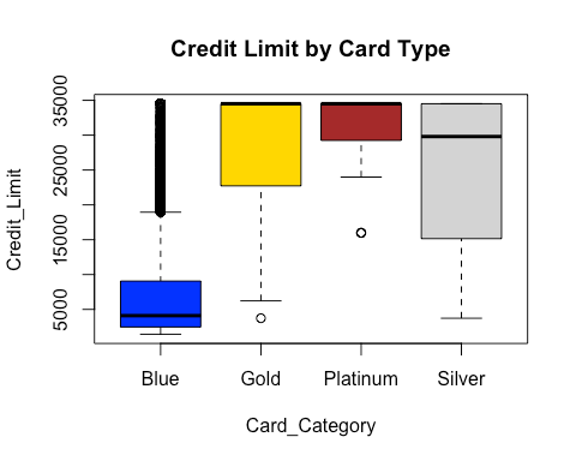

```r
dotplot(Credit_Limit ~ Card_Category , data = Bank)
```

*Output*

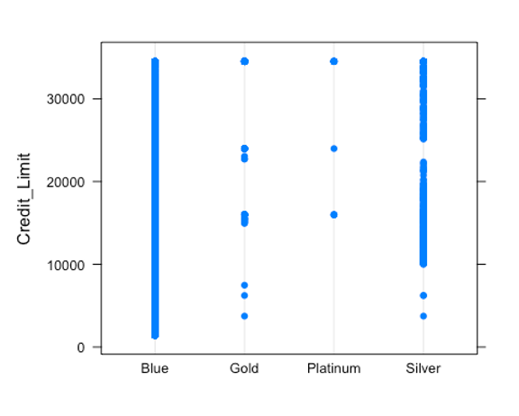

```r
bartlett.test(Credit_Limit ~ Card_Category , data = Bank)
```

*Output*

_Bartlett test of homogeneity of variances_

 _data:  Credit_Limit by Card_Category_
 
 _Bartlett's K-squared = 68.069, df = 3, p-value = 1.106e-14_

_Inference_: From the box plots, the blue card type has a lot of outliers and the median is quite far from the other card types. The gold and platinum card types have similar medians and the silver card type has a median closer to theirs but far from the median of the blue card type. Overall, from the plots, the card types do not have equal medians which could indicate that their means may not be equal. Also, the Bartlett test shows that they have unequal variances.

_AIM_: I aim to use an ANOVA test to investigate if the credit limits across distinct card categories are equal using the 0.05 significance level.

_ASSUMPTIONS_:
-  _Null Hypothesis (H0)_: The credit limit of each card category is equal.
-  _Alternate Hypothesis (H1)_: The credit limit of each card category is not equal.

```r
oneway.test(Bank$Credit_Limit~Bank$Card_Category, var.equal = FALSE) #Using a Welch's ANOVA because their variances are not equal.
```

*Output*

_One-way analysis of means (not assuming equal variances)_

 _data:  Bank$Credit_Limit and Bank$Card_Category_
 
 _F = 867.07, num df = 3.000, denom df = 79.821, p-value < 2.2e-16_

_RESULTS_: The F-statistic is 1232.1 and the p-value is < 2.2e-16.

_Inference_: Since the p value is very low (< the significance level 0.05), the null hypothesis that the credit limit of the different types of cards are equal will be rejected. Hence, accepting the alternative hypothesis that the different card categories have different credit limits.

## LINEAR REGRESSION
### CORRELATION
*QUESTION*: Is there a discernible correlation between customers’ credit limits, customer’s age and their total transaction amounts?

```r
library(corrplot)
## corrplot 0.92 loaded
#First, a check for correlation between both variables
cormat<-cor(Bank[, c("Total_Trans_Amt", "Credit_Limit", "Customer_Age")])
corrplot(cormat, method = "color", type="upper", addCoef.col="grey",tl.col="black")
```

*Output*

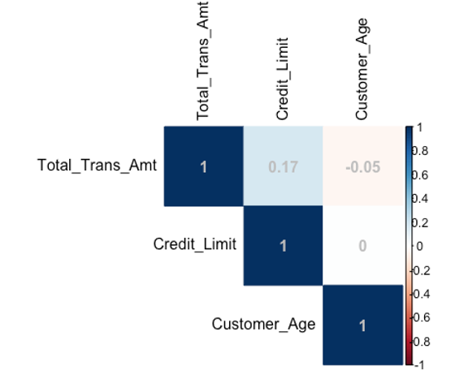

```r
plot(Bank$Total_Trans_Amt,Bank$Credit_Limit, main = "Scatter plot of Total Transaction Amount against Credit Limit", col = "blue")
abline(a = 0, b = 1, col = "red")
```

*Output*

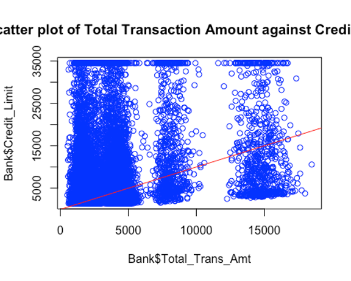

```r
plot(Bank$Total_Trans_Amt,Bank$Customer_Age, main = "Scatter plot of Total Transaction Amount against Customer Age", col = "red")
abline(Bank$Total_Trans_Amt,Bank$Customer_Age, col = "red")
```

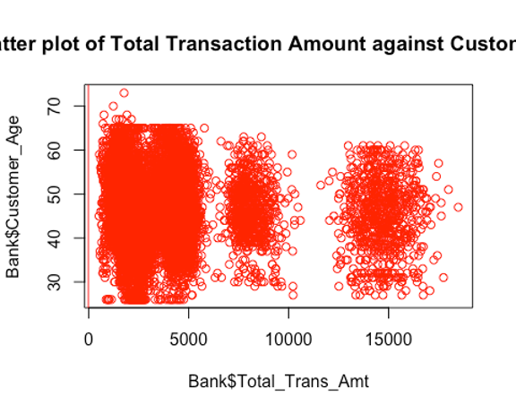

_Inference_: The result of the correlation test shows that there is a positive correlation between the credit limit and the total transaction amount which makes sense in the real world as it is expected that as the credit limit increases, the total transaction amount would increase because there’s more to spend. Also, there is a very weak negative correlation between the customer age and the total transaction limit. But the dot plots show that there is no clear linear pattern between response variables (i.e no multi-collinearity) and the target variable so more tests have to be done to conclude. Since, there is no major correlation between the response variables, I will go ahead to use both of them.

*PROBLEM STATEMENT*: The bank is curious to know if customers’ credit limits and customer’s age can determine their total transaction amounts.
_AIM_: Using a linear model to see whether the credit limit and customer age determine the the total transaction amount, to see if the credit limit and age play a role in the usage of the cards.

_ASSUMPTIONS_:
-  Null Hypothesis (H0): The credit limit and customer age do not contribute statistically to determine the total transaction amount
-  Alternate Hypothesis (H1): The credit limit and customer age contribute statistically to determine the total transaction amount

```r
Reg <- lm(Bank$Total_Trans_Am ~ Bank$Credit_Limit+Bank$Customer_Age)
summary(Reg)
```
*Output*

_Call:_

 _lm(formula = Bank$Total_Trans_Am ~ Bank$Credit_Limit + Bank$Customer_Age)_
 
 _Residuals:
     Min      1Q  Median      3Q     Max_ 

 _-5377.1 -2169.7  -494.4   651.1 13997.3_ 
 
 _Coefficients:
                     Estimate Std. Error t value Pr(>|t|)    
 (Intercept)        4.770e+03  1.973e+02  24.175  < 2e-16 ***_

 _Bank$Credit_Limit  6.423e-02  3.655e-03  17.571  < 2e-16 ***_
 
 _Bank$Customer_Age -1.986e+01  4.144e+00  -4.793 1.67e-06 ***_


 _Signif. codes:  0 '***' 0.001 '**' 0.01 '*' 0.05 '.' 0.1 ' ' 1_
 
 _Residual standard error: 3343 on 10124 degrees of freedom_
 
 _Multiple R-squared:  0.03169,    Adjusted R-squared:  0.0315_ 
 
 _F-statistic: 165.7 on 2 and 10124 DF,  p-value: < 2.2e-16_

_RESULTS_: The linear model gives a range of results, and they are as follows: The intercept is 4.770e+03, the credit limit estimate is 6.423e-02 and the p-value is < 2.2e-16 while the customer age estimate is -1.986e+01 and the p-value is 1.67e-06.
_Inference_: The null hypothesis should clearly be rejected because the p-value<2.2e-16 which is way less than the 0.001 significance level. i.e I do not have enough evidence to say that the credit limit and customer age are not statistically significant determinants for the total transaction amount.

## CHI-SQUARE TEST
*PROBLEM STATEMENT*: Is there an independence between the attrition flag and the marital status of the customers?
_AIM_: Using a Chi-squared test to see if there is an independence between the attrition flag and the marital status of the customers.

_ASSUMPTIONS_:
-  Null Hypothesis (H0): There is an independence between the marital status and attrition flag of customers.
-  Alternate Hypothesis (H1): There is no independence between the marital status and attrition flag of customers.

```r
# Creating a contingency table
contingency_table <- table(Bank$Attrition_Flag, Bank$Marital_Status)
head(contingency_table)
```

*Output*

|                       | Divorced | Married | Single | Unknown |
|-----------------------|----------|---------|--------|---------|
| **Attrited Customer** |      121 |     709 |    668 |     129 |
| **Existing Customer** |      627 |    3978 |   3275 |     620 |

```r
#Checking for the expected frequencies
expectedFreq <- chisq.test(contingency_table)$expected
print(expectedFreq)
```

*Output*

|                       | Divorced  | Married   | Single   | Unknown  |
|-----------------------|-----------|-----------|----------|----------|
| **Attrited Customer** | 120.1734  | 753.0117  | 633.4809 | 120.3341 |
| **Existing Customer** | 627.8266  | 3933.9883 | 3309.5191| 628.6659 |

Since the expected frequencies are greater than 5, I will go ahead to test for independence.

```r
# Performing the chi-squared test
chisq.test(contingency_table, confint(level = 0.95))
```

*Output*

_Pearson's Chi-squared test_

 _data:  contingency_table_
 
 _X-squared = 6.0561, df = 3, p-value = 0.1089_

_RESULTS_: The Chi-squared testgives a range of results, and they are as follows: The x-squared value is 6.0561 and the p-value is 0.1089.
_Inference_: Since the p-value is 0.1089 which is greater than the significance level 0.05, the null hypothesis Ho, that there an independence between the marital status and attrition flag of customers, cannot be rejected due to lack of evidence.

## LOGISTIC REGRESSION
*PROBLEM STATEMENT*: Are the customer age, total transaction amount, gender, card category and the credit limit all statistically significant in predicting the log odds of a customer’s attrition?

_ASSUMPTIONS_
-  _Null Hypothesis (H0)_: The customer age, total transaction amount, gender, card category and credit limit are not statistically significant in predicting the log odds of a customer’s attrition.
-  _Alternate Hypothesis (H1)_: The customer age, total transaction amount, gender, card category and credit limit are all statistically significant in predicting the log odds of a customer’s attrition.

```r
# Specifying the categorical variables
Genderf <- factor(Bank$Gender, levels = c("M", "F"))
Card_Categoryf <- factor(Bank$Card_Category, levels = c("Blue", "Gold", "Platinum", "Silver"))
Attrition_Flagf <- factor(Bank$Attrition_Flag, levels = c("Existing Customer", "Attrited Customer"))

# Logistic regression model
fit <- glm(Attrition_Flagf ~ Customer_Age + Total_Trans_Amt + Genderf + Card_Categoryf + Credit_Limit, 
           data = Bank, 
           family = "binomial")

# Summary of the logistic regression model
summary(fit)
```

*Output*

_Call:
glm(formula = Attrition_Flagf ~ Customer_Age + Total_Trans_Amt + 
     Genderf + Card_Categoryf + Credit_Limit, family = "binomial", 
     data = Bank)_
 
 _Deviance Residuals: 
     Min       1Q   Median       3Q      Max  
 -1.3999  -0.6362  -0.5507  -0.3344   2.7004_  
 
 _Coefficients:
                          Estimate Std. Error z value Pr(>|z|)_    
 _(Intercept)            -1.027e+00  1.750e-01  -5.871 4.33e-09 ***_
 
 _Customer_Age            3.072e-03  3.368e-03   0.912  0.36165_    
 
 _Total_Trans_Amt        -2.575e-04  1.553e-05 -16.576  < 2e-16 ***_
 
 _GenderfF                2.770e-01  6.273e-02   4.416 1.01e-05 ***_
 
 _Card_CategoryfGold      8.787e-01  2.749e-01   3.196  0.00139 **_ 
 
 _Card_CategoryfPlatinum  1.608e+00  5.932e-01   2.711  0.00671 **_ 
 
 _Card_CategoryfSilver    2.949e-01  1.465e-01   2.013  0.04414 *_


_Credit_Limit           -2.407e-07  4.134e-06  -0.058  0.95358_    

 _Signif. codes:  0 '***' 0.001 '**' 0.01 '*' 0.05 '.' 0.1 ' ' 1_
 
 _(Dispersion parameter for binomial family taken to be 1)_
 
 _Null deviance: 8927.2  on 10126  degrees of freedom
 Residual deviance: 8480.0  on 10119  degrees of freedom
 AIC: 8496_
 
 _Number of Fisher Scoring iterations: 6_

_RESULTS_: The logistic regression gives a range of results, and they are as follows: The intercept is -1.025e+00 at the 0.001 significance level, the p-value of customer age is 0.485021 at the 0.001 significance level, the p-value of the total transaction amount is < 2.2e-16 at the 0.001 significance level,  the p-value of gender compared to female (reference group is male) is 0.000319 at the 0.001 significance level, the p-value of credit limit is 0.916083 at the 0.001 significance level, the p-value of the card category compared to gold (reference group is blue) is 0.021446 at the 0.05 significance level, the p-value of card category compared to platinum (reference group is blue) is 0.001027 at the 0.01 significance level and the p-value of card category compared to silver (reference group is blue) is 0.012628 at the 0.05 significance level.

_Inference_: Since p-value = 0.485>0.001, the result shows that the age of the customers has no statistically significant effect on the chance of attrition. On the other hand, total transaction amount stands out as a critical component, showing a highly significant negative connection (p-value < 0.001) with attrition, suggesting that larger transaction amounts are linked to reduced attrition odds. The log-odds of attrition are significantly higher for female gender than for male reference group, with a highly significant p-value of less than 0.001 and a positive coefficient of 0.2557. Furthermore, compared to the reference category (Blue), the card categories Gold, Platinum, and Silver show positive and significant coefficients, indicating higher log-odds of attrition. On the other hand, credit limit does not show a statistically significant effect on the log-odds of attrition (p-value = 0.916). Overall, these findings shed light on the influential factors contributing to customer attrition within the dataset.

---

## Importing the Video Game Sales dataset
# VIDEO GAME SALES DATASET:
The dataset encapsulates a wealth of information about video game sales, spanning continents, genres, platforms, and publishers. From the amount of sales in North America and Europe to the global sales figure, this dataset provides a holistic view of the gaming landscape.
```r
library(readr)
Game <- read.csv("VidGameSaless.csv")
#Checking the contents of the data
head(Game)
```

*Output*

| Rank | Name                     | Platform | Year | Genre        | Publisher | NA_Sales | EU_Sales | JP_Sales | Other_Sales | Global_Sales |
|------|--------------------------|----------|------|--------------|-----------|----------|----------|----------|-------------|--------------|
| 1    | Wii Sports               | Wii      | 2006 | Sports       | Nintendo  | 41.49    | 29.02    | 3.77     | 8.46        | 82.74        |
| 2    | Super Mario Bros.        | NES      | 1985 | Platform     | Nintendo  | 29.08    | 3.58     | 6.81     | 0.77        | 40.24        |
| 3    | Mario Kart Wii           | Wii      | 2008 | Racing       | Nintendo  | 15.85    | 12.88    | 3.79     | 3.31        | 35.82        |
| 4    | Wii Sports Resort        | Wii      | 2009 | Sports       | Nintendo  | 15.75    | 11.01    | 3.28     | 2.96        | 33.00        |
| 5    | Pokemon Red/Pokemon Blue | GB       | 1996 | Role-Playing | Nintendo  | 11.27    | 8.89     | 10.22    | 1.00        | 31.37        |
| 6    | Tetris                   | GB       | 1989 | Puzzle       | Nintendo  | 23.20    | 2.26     | 4.22     | 0.58        | 30.26        |

Note that the Sales amounts are in millions.

```r
#Checking the summary of the dataset
summary(Game)
```

*Output*

| Statistic | Rank              | Name              | Platform          | Year              | Genre          | Publisher       | NA_Sales       | EU_Sales       | JP_Sales       | Other_Sales    | Global_Sales   |
|-----------|-------------------|-------------------|-------------------|-------------------|-----------------|-----------------|----------------|----------------|----------------|----------------|----------------
| Min.      | 1.0               | Length:2624       | Length:2624       | Length:2624       | Length:2624    | Length:2624     | 0.000          | 0.0000         | 0.000          | 0.0000         | 0.790          
| 1st Qu.   | 657.8             | Class :character  | Class :character  | Class :character  | Class :character| Class :character| 0.470          | 0.2100         | 0.000          | 0.0700         | 1.050         
| Median    | 1313.5            | Mode  :character  | Mode  :character  | Mode  :character  | Mode  :character| Mode  :character| 0.750          | 0.4200         | 0.020          | 0.1200         | 1.460         
| Mean      | 1313.3            |                   |                   |                   |                |                 | 1.155          | 0.6857         | 0.298          | 0.2215         | 2.360          
| 3rd Qu.   | 1969.2            |                   |                   |                   |                |                 | 1.262          | 0.7625         | 0.260          | 0.2200         | 2.382          
| Max.      | 2625.0            |                   |                   |                   |                |                 | 41.490         | 29.0200        | 10.220         | 10.5700        | 82.740         


The data set has a total of 11 variables and 2,624 observations. This suggests that the normality checks using a Shapiro Test will be applicable since the sample size is < 3,000.


## WILCOXON RANK SUM TEST
*PROBLEM STATEMENT*: Are the video game sales in North America (NA) and Europe (EU) equal?
*EXPLORATORY DATA ANALYSIS*: A visual representation of the NA sales and EU sales

```r
hist(Game$NA_Sales, main =   "Histogram of games sales in North America(NA)")
```
*Output*

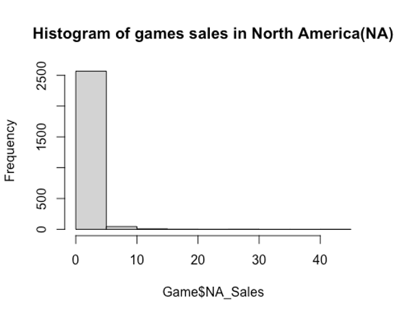

```r
hist(Game$EU_Sales, main =   "Histogram of games sales in Europe(EU)")
```

*Output*


_Inference_: From the histograms, it is clear that the distributions of the sales in both NA and EU are not normal but right skewed. Using Shapiro test and Q-Q plots to check the normality of the NA sales and EU sales.

```r
shapiro.test(Game$NA_Sales)
```

*Output*

_Shapiro-Wilk normality test_
 
_data:  Game$NA_Sales_

_W = 0.42281, p-value < 2.2e-16_

_shapiro.test(Game$EU_Sales)_
 
_Shapiro-Wilk normality test_
 
_data:  Game$EU_Sales_

_W = 0.46304, p-value < 2.2e-16_

```r
qqnorm(Game$NA_Sales, col="purple", main = "Q-Q Plot of NA Sales")
qqline(Game$NA_Sales, col="black")
```
*Output*

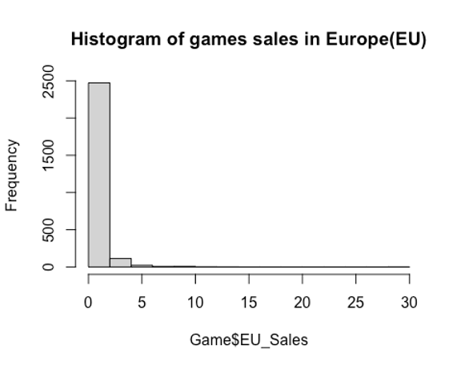

```r
qqnorm(Game$EU_Sales, col="red",main = "Q-Q Plot of EU Sales")
qqline(Game$EU_Sales, col="black")
```

*Output*

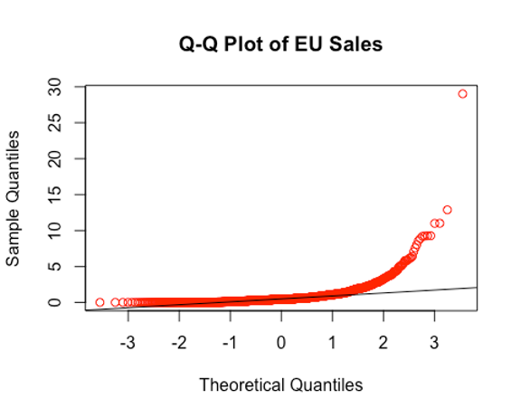

_Inference_: Since the p-values of both tests show that p < the significance level 0.05 and the Q-Q plots deviating from a straight line, we conclude that the NA sales and EU sales are not normally distributed, therefore being appropriate for a non-parametric test.

Box plots to check the distribution of sales in NA and EU
```r
boxplot((Game$NA_Sales), (Game$EU_Sales), names = c("NA_Sales", "EU_Sales"),ylim = c(0, 9.5), main = "Boxplots of NA and EU sales")
```

*Output*

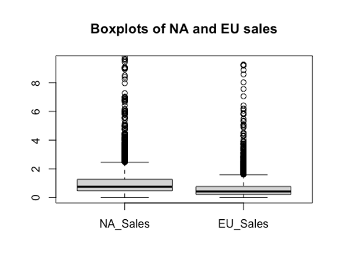

_Inference_: From the box plots, it is obvious that the median of the NA sales are greater than that of the EU sales, which could imply that the mean of NA sales could be greater too.
_AIM_: Using a Wilcoxon rank-sum test to check the null hypothesis that the video game sales in NA and EU are equal.
_ASSUMPTIONS_:
-   _Null Hypothesis (H0)_: The video game sales in NA and EU are equal.
-  	_Alternate Hypothesis (H1): The video game sales in NA are greater than those in EU.

```r
wilcox.test(Game$NA_Sales,Game$EU_Sales,alternative = "greater",conf.int = TRUE)
```

*Output*

_Wilcoxon rank sum test with continuity correction_

_data:  Game$NA_Sales and Game$EU_Sales_
 
 _W = 4679332, p-value < 2.2e-16_
 
 _alternative hypothesis: true location shift is greater than 0_
 
 _95 percent confidence interval:_
 
  _0.290025      Inf_
 
 _sample estimates:_
 
 _difference in location_ 
              
 _0.3100372_

_RESULTS_: The Wilcoxon Rank Sum test gives a W-statistic of 4679332 in a confidence interval of -0.290025 to 0.290025 and a p-value which is <2.2e-16 at the 0.05 significance level.
_Inference_: Since the p-value < the significance level 0.05, the null hypothesis is rejected. Suggesting that there is evidence that the sales in North America are greater than the sales in Europe.


## KRUSKALL-WALLIS TEST
*PROBLEM STATEMENT*: Is there a significant difference in the global sales from 2011 to 2014?
*EXPLORATORY DATA ANALYSIS*: Normality tests on the global sales from 2011 to 2014

_ASSUMPTIONS_:
-  _Null Hypothesis (H0)_: Global sales across the years 2011, 2012, 2013, and 2014 are normally distributed
-  _Alternative Hypothesis (H1)_: Global sales across the years 2011, 2012, 2013, and 2014 are not normally distributed

```r
# Filtering data for the years 2011 to 2014
subset_data <- subset(Game, Year %in% c(2011, 2012, 2013, 2014))

# Creating an empty vector to store p-values
p_values <- numeric()

# Looping through each year and perform the Shapiro-Wilk test
for (year in c(2011, 2012, 2013, 2014)) {
  subset_sales <- subset_data$Global_Sales[subset_data$Year == year]
  shapiro_result <- shapiro.test(subset_sales)
  p_values <- c(p_values, shapiro_result$p.value)
}

# Creating a data frame with the results
results_df <- data.frame(Year = c(2011, 2012, 2013, 2014), p_value = p_values)
# Displaying the results
print(results_df)
```
*Output*

| Year | p_value       |
|------|---------------|
| 2011 | 1.287281e-17  |
| 2012 | 6.394927e-17  |
| 2013 | 1.258310e-17  |
| 2014 | 2.551033e-12  |

_Inference_: From the results, the p values for all the year are < significance level of 0.05 and thus, the null hypothesis that they are normally distributed is rejected.

_AIM_: I aim to use a Kruskall-Wallis test to check if there is a significant difference in global sales from 2011 to 2014.

_ASSUMPTIONS_:
-  _Null Hypothesis (H0)_: There is no difference in global sales across the years 2011, 2012, 2013, and 2014.
-  _Alternative Hypothesis (H1)_: There is a significant difference in global sales across at least one of the years.

```r
kruskal.test(Global_Sales ~ Year, data = subset_data)
```

*Output*

 _Kruskal-Wallis rank sum test_

 _data:  Global_Sales by Year_

 _Kruskal-Wallis chi-squared = 7.3606, df = 3, p-value = 0.06125_

_RESULTS_: The Kruskal-Wallis test gives that the Kruskal-Wallis chi-squared is 7.3606 and a p-value which is 0.06125 at the 0.05 significance level.

_Inference_: In this case, the p-value is 0.06125, which is slightly larger than the common significance level of 0.05. Therefore, I choose not to reject the null hypothesis at the 0.05 significance level.
 
## REFERENCES
1.      Chauhan, A. (2022) Credit card customers prediction, Kaggle. Available at: https://www.kaggle.com/datasets/whenamancodes/credit-card-customers-prediction (Accessed: 11 November 2023).
2.      GregorySmith (2016) Video game sales, Kaggle. Available at: https://www.kaggle.com/datasets/gregorut/videogamesales (Accessed: 11 November 2023).


